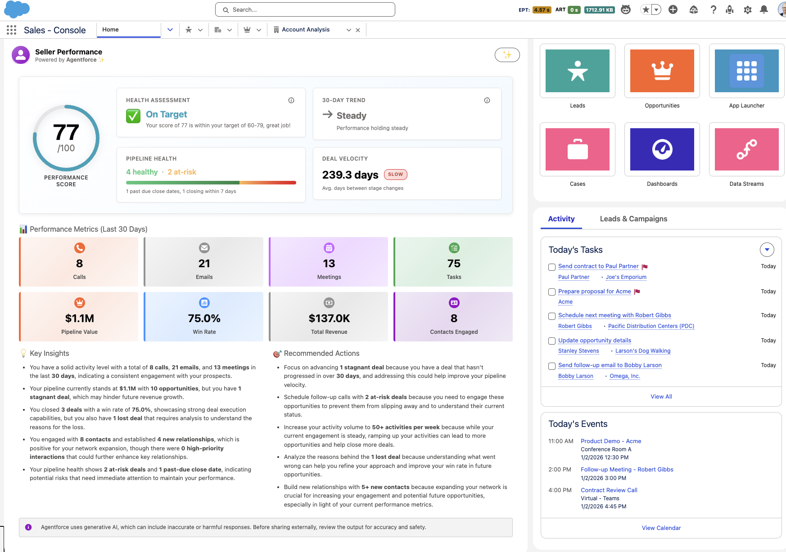

# Seller Performance Dashboard - Powered by Agentforce 🪄



Salesforce Lightning Web Component for analyzing seller performance metrics with AI-powered insights.

## Prerequisites

- Salesforce org (Developer, Sandbox, or Production)
- Salesforce CLI (SFDX) installed
- Einstein Generative AI enabled in your org (for AI insights)

## Setup Instructions

### 1. Clone the Repository

```bash
git clone https://github.com/dylandersen/sellerPerformance.git
cd sellerPerformance
```

### 2. Authenticate with Salesforce

```bash
sf org login web --alias myorg
```

Or use an existing org:

```bash
sf org login web --alias myorg --instance-url https://yourinstance.salesforce.com
```

### 3. Deploy to Your Org

Deploy all metadata to your Salesforce org:

```bash
sf project deploy start
```

Or deploy specific components:

```bash
# Deploy Apex classes
sf project deploy start --source-dir classes

# Deploy Lightning Web Component
sf project deploy start --source-dir lwc
```

### 4. Enable Einstein Generative AI (Required for AI Insights)

1. In Salesforce Setup, navigate to **Einstein Setup** → **Einstein Generative AI**
2. Enable Einstein Generative AI
3. Configure the default AI model (or ensure `sfdc_ai__DefaultOpenAIGPT4OmniMini` is available)

### 5. Assign Permissions

Ensure users have access to:
- **Apex Classes**: `SellerPerformanceController`, `SellerPerformanceAnalysis`, `SellerPerformanceMetrics`
- **Lightning Web Component**: `sellerPerformance`
- **Object Permissions**: Read access to Tasks, Events, EmailMessage, Opportunity, Contact, Account, User

Create a Permission Set or modify existing profiles:

1. Setup → Permission Sets → New
2. Add Apex Class access for all three classes
3. Add Lightning Web Component access for `sellerPerformance`
4. Assign to users

### 6. Add Component to Lightning Page

1. Navigate to any Lightning App Builder page (Home, Record Page, etc.)
2. Edit the page
3. Drag the **sellerPerformance** component onto the page
4. Save and activate

## Components

- **sellerPerformance** (LWC) - Main component displaying performance dashboard
- **SellerPerformanceController** (Apex) - Controller handling data retrieval and AI analysis
- **SellerPerformanceAnalysis** (Apex) - Wrapper class for analysis results
- **SellerPerformanceMetrics** (Apex) - Wrapper class for performance metrics

## Features

- **Performance Score**: Calculated score (0-100) based on activity, pipeline, deal execution, and relationships
- **AI-Powered Insights**: Einstein AI generates personalized insights and recommendations
- **Activity Metrics**: Tracks calls, emails, meetings, and tasks over the last 30 days
- **Pipeline Health**: Monitors pipeline value, deal velocity, and at-risk deals
- **Deal Execution**: Win rate, revenue, and deal size analysis
- **Relationship Building**: Contact engagement and new relationship tracking

## Troubleshooting

**Component not loading data:**
- Verify user has access to required objects (Tasks, Events, Opportunities, etc.)
- Check browser console for errors
- Ensure Einstein AI is enabled and configured

**AI insights not appearing:**
- Verify Einstein Generative AI is enabled in Setup
- Check that the AI model `sfdc_ai__DefaultOpenAIGPT4OmniMini` is available
- Review debug logs for AI API errors

**Permission errors:**
- Ensure Apex classes are accessible via Permission Set or Profile
- Verify Lightning Web Component is added to the user's profile/permission set

## Support

For issues or questions, please open an issue on the [GitHub repository](https://github.com/dylandersen/sellerPerformance).
